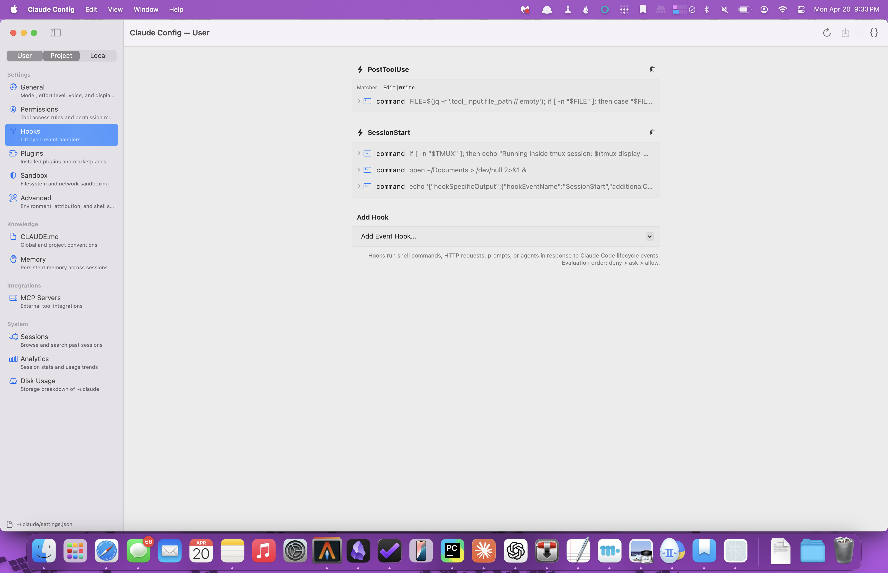

# Claude Config

> A native macOS app for managing your [Claude Code](https://docs.anthropic.com/en/docs/claude-code) configuration — settings, CLAUDE.md, memory, MCP servers, sessions, and analytics — all in one place.



## Why

Claude Code stores its configuration across a sprawl of JSON files, Markdown documents, and JSONL logs under `~/.claude/`. Editing `settings.json` by hand is tedious and error-prone. This app gives you a System Settings-style GUI with scope awareness, validation, and auto-save.

## At a Glance

| Section | What it does |
|---------|-------------|
| **Settings** | Visual editor for all ~60 settings.json fields across 6 panels |
| **CLAUDE.md** | Monospaced editor for global and project convention files |
| **Memory** | Browse, create, edit, and delete memory files with frontmatter |
| **MCP Servers** | Configure stdio/SSE/HTTP/WS servers + view plugin-provided ones |
| **Sessions** | Search past sessions, read transcripts, inspect tool call I/O |
| **Analytics** | Token usage, tool breakdown, language stats, session history |
| **Disk Usage** | Storage breakdown with cleanup actions |

## Key Features

**Scope-aware editing** — A single User / Project / Local picker in the sidebar drives every view. When set to Project, a dropdown lets you select from all known projects. Settings show inherited values from parent scopes as ghost indicators.

**Settings editor** — Grouped form panels for General, Permissions, Hooks, Plugins, Sandbox, and Advanced. Toggle to raw JSON for power-user editing. Permission rules are validated inline. Undo/redo with Cmd+Z.

**Session browser** — Searchable list of all sessions with a split-pane transcript viewer. Tool calls are collapsible disclosure rows showing input parameters and results. Sessions without full transcripts fall back to user prompts from history.jsonl. Filter by project. Delete sessions with full cleanup across all data files.

**MCP server editor** — Visual config for stdio (command + args + env), SSE, HTTP, and WebSocket transports. Reads from `~/.claude.json`, `.mcp.json`, or `claude_desktop_config.json` depending on scope. Shows plugin-provided servers in a read-only section.

**Disk cleanup** — One-click cleanup for debug logs, shell snapshots, file history, and cache. Confirmation dialogs show file counts and sizes before deleting.

## Building

Requires macOS 14+ (Sonoma), Xcode 16+, and [XcodeGen](https://github.com/yonaskolb/XcodeGen).

```bash
brew install xcodegen        # one-time setup
xcodegen generate            # generate .xcodeproj from project.yml
open ClaudeConfigGUI.xcodeproj  # open in Xcode and hit Run
```

Or build from the command line:

```bash
xcodebuild -project ClaudeConfigGUI.xcodeproj \
  -scheme ClaudeConfigGUI \
  -destination 'platform=macOS' \
  -derivedDataPath build build

open build/Build/Products/Debug/Claude\ Config.app
```

## Architecture

```
Sources/
  App/           ClaudeConfigApp (Window scene), ContentView, Assets
  Models/        ClaudeSettings, ConfigScope, MemoryEntry, SessionHistory,
                 MCPConfig, SessionStats
  ViewModels/    AppState, ConfigEditor (with undo + file watching),
                 MarkdownFileEditor, MCPConfigEditor
  Views/
    Sidebar/     SidebarView (grouped sections + scope picker), DetailView (router)
    Detail/      GeneralSettingsView, PermissionsView, HooksView, PluginsView,
                 SandboxView, AdvancedSettingsView, ClaudeMdView, MemoryBrowserView,
                 MCPServersView, SessionBrowserView, AnalyticsView, DiskUsageView,
                 RawJSONView
    Components/  OptionalToggle, OptionalPicker, OptionalStepper, described() modifier
```

**Design decisions:**

- **`@Observable`** (not `ObservableObject`) — access-tracked, no `@Published` boilerplate
- **`Window` scene** (not `WindowGroup`) — singleton window, no Cmd+N duplication
- **Plain `Codable`** (not SwiftData) — it's just JSON files on disk
- **No App Sandbox** — needs direct read/write to `~/.claude/`
- **Debounced auto-save** — 1-second delay via `Task.sleep`, `DispatchSource` file watching for external edits
- **JSON round-trip preservation** — `~/.claude.json` has many keys beyond `mcpServers`; uses `JSONSerialization` dictionary merge to preserve unknown keys

## Non-goals

- Not a chat interface (see [OpCode](https://github.com/winfunc/opcode) for that)
- Not a plugin development environment
- Not an MCP server runtime — just config editing

## License

MIT
